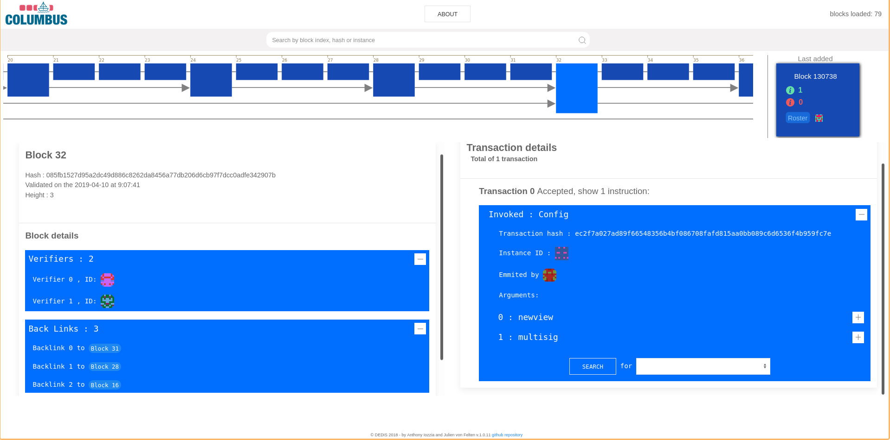

# columbus-united

<div align="center">
    
</div>

<div align="center">
  <a href="https://github.com/dedis/columbus-united/actions?query=workflow%3A%22Wookiee+deployment%22">
    
  </a>
  <a href="https://github.com/dedis/columbus-united/actions?query=workflow%3A%22Wookiee+DEV+deployment%22">
    
  </a>
  <br/>
  <a href="https://github.com/dedis/columbus-united/actions?query=workflow%3APrettier">
    
  </a>
  <a href="https://github.com/dedis/columbus-united/actions?query=workflow%3A%22Quality+checking">
    
  </a>
</div>

Implementation of an intuitive and insightful blockchain explorer. The Columbus
project is a project aiming to facilitate the visualization of the
[Byzcoin](https://github.com/dedis/cothority/tree/master/byzcoin) blockchain by
providing a unified and interactive visualization tool.

This tool is a web based application written in typescript, bundled with
webpack, and using the d3 and rxjs librairies.

👌 **Quick TL;DR setup**:

1) Rename `src/roster.ts.template` to `src/roster.ts`
2) Install dependencies with `npm install`
3) Bundle the app with `npm run bundle`
4) You are ready to go, open `index.html`

[Play with it](https://wookiee.ch/columbus/)

<div align="center">
    
</div>

### Some useful commands

Bundle the project (from the root): `npm run bundle`  
Watch for source code changes and automatically bundle: `npm run watch`  
Check TypeScript code formatting: `npm run lint`  
Check if the code is well formatted: `npm run isPretty`  
Format the code: `npm run makePretty`  

## Setup (ubuntu)

Install nodejs and npm:

```bash
sudo apt-get install nodejs
sudo apt-get install npm
```

Rename `src/roster.ts.template` to `src/roster.ts` and replace the return
section with your roster configuration. You can connect to an existing conode
runing the DEDIS production blockchain, for example by connecting to the
following node (which is already configured by default in the template file):

```toml
[[servers]]
  Address = "tls://188.166.35.173:7770"
  Url = "https://wookiee.ch/conode"
  Suite = "Ed25519"
  Public = "a59fc58c0a445b70dcd57e01603a714a2ee99c1cc14ca71780383abada5d7143"
  Description = "Wookiee's Cothority"
  [servers.Services]
    [servers.Services.ByzCoin]
      Public = "70c192537778a53abb9315979f48e170da9182b324c7974462cbdde90fc0c51d440e2de266a81fe7a3d9d2b6665ef07ba3bbe8df027af9b8a3b4ea6569d7f72a41f0dfe4dc222aa8fd4c99ced2212d7d1711267f66293732c88e8d43a2cf6b3e2e1cd0c57b8f222a73a393e70cf81e53a0ce8ed2a426e3b0fa6b0da30ff27b1a"
      Suite = "bn256.adapter"
    [servers.Services.Skipchain]
      Public = "63e2ed93333bd0888ed2b5e51b5e2544831b4d79dead571cf67604cdd96bc0212f68e582468267697403d7ed418e70ed9fcb01940e4c603373994ef00c04542c24091939bddca515381e0285ab805826cec457346be482e687475a973a20fca48f16c76e352076ccc0c866d7abb3ac50d02f9874d065f85404a0127efc1acf49"
      Suite = "bn256.adapter"
```

Otherwise, follow instructions in the next section to run a local conode and get
a local roster configuration.

Finally, install dependencies with `npm install`.  

You are ready to use the app: bundle it with `npm run bundle` and open
`index.html`.

## If you need to run a local blockchain

If you are developing on Columbus you will need to use a local blockchain in
order to avoid over-loading a node running the production blockchain.

Download and extract the latest binaries from
https://github.com/c4dt/byzcoin/releases. Choose the folder corresponding to
your environment (only Mac and Linux is supported) and run the `byzcoin` binary
in "proxy" mode. You need to provide an existing database. You can download a
cached database reflecting the production data at
[https://demo.c4dt.org/omniledger/cached.db](https://demo.c4dt.org/omniledger/cached.db).

Then, run the node in "proxy" mode with :

```
./byzcoin proxy <MY_DATABASE.db>
```

That's it ! This will run a node listening on 127.0.0.1:7771.

You can stop it with <kbd>ctrl</kbd> + <kbd>C</kbd>.

There are additional options that you can spot with `./byzcoin proxy -h`.

You can then use the following roster in your `roster.ts`:

```
[[servers]]
  Url = "http://127.0.0.1:7771"
  Suite = "Ed25519"
  Public = "0000000000000000000000000000000000000000000000000000000000000000"
```

## Recommendations for Visual Studio Code

### Settings

Add vertical lines at columns 80 and 100: `editor.rulers` -> `Edit in settings.json` -> `"editor.rulers": [80,100]`  

### Extensions

#### Live Server

Purpose: Automatically refresh the html upon compile  
Install: `ritwickdey.liveserver`  
Use:

* Right click on `index.html`
* `Open with Live Server`

#### Prettier - Code formatter

Purpose: Automatically format the code  
Install: `esbenp.prettier-vscode`  
Setup: setting `editor.defaultFormatter` -> select `esbenp.prettier-vscode`  
Use:

* Open Command Palette (`Ctrl+Shift+P`)
* `Format Document`

#### TypeScript Hero

Purpose: Automatically organize TypeScript imports  
Install: `rbbit.typescript-hero`  
Use:

* Open Command Palette (`Ctrl+Shift+P`)
* `TS Hero: Organize imports`

#### Rewrap

Purpose: Automatically reformat comments to a given line length (default is 80)  
Install: `stkb.rewrap`  
Use:

* Open Command Palette (`Ctrl+Shift+P`)
* `Rewrap Comment / Text`

#### Comment Anchor
Purpose: Place anchor tags within comments for easy file & workspace navigation.
Install: `ext install ExodiusStudios.comment-anchors`
Use:

* Use \\\\ANCHOR and \\\\SECTION to delimitate code regions
* Use \\\\TODO, \\\\FIXME to mark specific areas
* Read the documentation for more features

## Stack

- Typescript, as the frontend language
- NPM, as the package manager
- Webpack, as the bundler
- d3, as the visualization library
- RxJS, as the reactive programming library
- UIkit, as the CSS framework

## Production deployment

A change on the `production` branch automatically triggers a deployment on
[https://wookiee.ch/columbus](https://wookiee.ch/columbus).

The production branch must only be used that way:

```bash
# Trigger a deployment:
git push origin master:production
```

## Dev deployment

A change on the `deploy-dev` branch automatically triggers a deployment on
[https://wookiee.ch/columbus-dev](https://wookiee.ch/columbus-dev).

The `deploy-dev` branch must only be used that way:

```bash
# Trigger a deployment:
git push origin <source branch>:deploy-dev
```

## Documentation

Generate the documentation: `npm run doc`

## Design Guidelines
Can be found in the most recent report  

## Contributors

Supervision and integration

- Noémien Kocher

Student project Spring 2020:

- Anthony Iozzia ([report](https://www.epfl.ch/labs/dedis/wp-content/uploads/2020/06/report-2020-1-Anthony-Iozzia-Columbus-II.pdf))
- Julien von Felten ([report](https://www.epfl.ch/labs/dedis/wp-content/uploads/2020/06/report-2020-1-Julien-von-Felten-Columbus-I.pdf))

Student project Fall 2020:

- Sophia Artioli 
- Lucas Trognon

[Common report](https://www.epfl.ch/labs/dedis/wp-content/uploads/2021/01/report-2020-3-Columbus-Sophia-Artiolis-Lucas-Trognon-Columbus-III.pdf)
